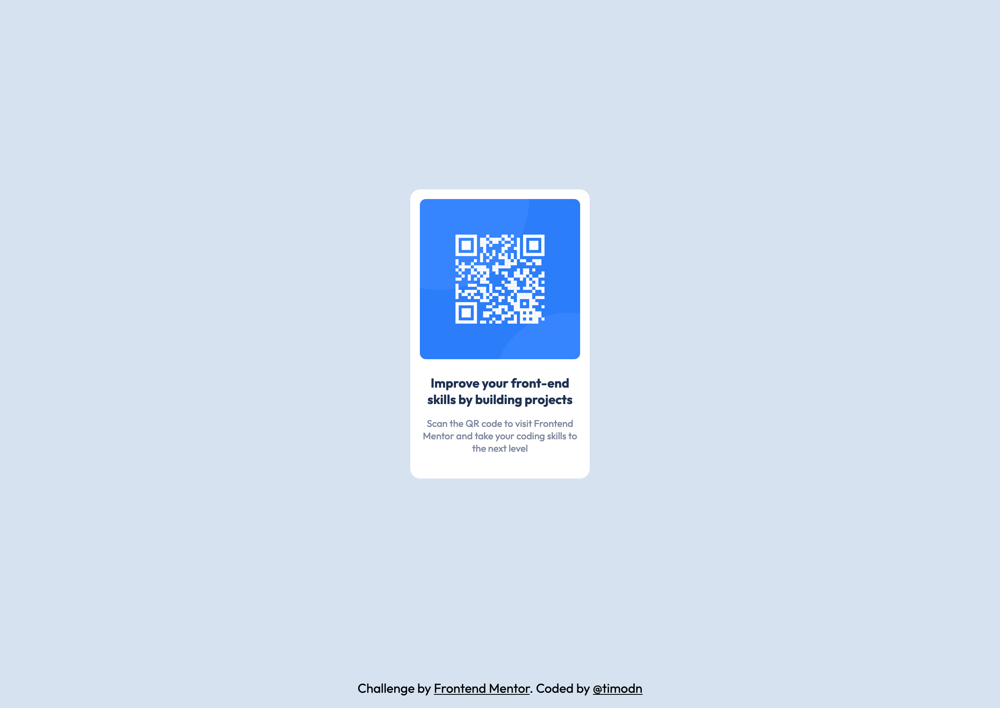

# Frontend Mentor - QR code component solution

This is a solution to the [QR code component challenge on Frontend Mentor](https://www.frontendmentor.io/challenges/qr-code-component-iux_sIO_H). Frontend Mentor challenges help you improve your coding skills by building realistic projects. 

## Table of contents

  - [Screenshot](#screenshot)
  - [Links](#links)
  - [Built with](#built-with)
  - [What I learned](#what-i-learned)
  - [Continued development](#continued-development)
  - [Author](#author)

### Screenshot

### Links

- Solution URL: [Add solution URL here]()
- Live Site URL: [Add live site URL here]()

### Built with

- CSS custom properties

### What I learned

Since I have a bit of a struggle with building responsive stuff, to be able to practice on that with this challenge has been really helpful.

### Continued development

I would love to build more responsive projects and gradually see the improvements that I'll make.

## Author

- Frontend Mentor - [@timodn](https://www.frontendmentor.io/profile/timodn)